# Welcome to trianglecircle 👋


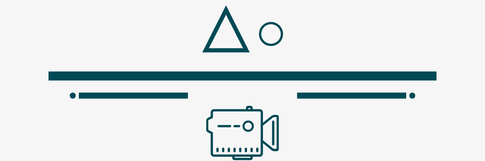

> 세모영 (세상의 모든 영화) 웹사이트

### 🏠 [Homepage](https://brave-hamilton-108ad5.netlify.app/)

<br>

## ⚙️ 실행 방법

- pip를 이용해 프로젝트에 필요한 패키지를 설치합니다.

  - ```bash
    $ pip install -r requirements.txt
    ```

- migrate을 실행합니다.

  - ```bash
    $ python manage.py migrate
    $ python manage.py runserver
    ```

- Django 프로젝트를 실행합니다.

  - ```bash
    $ python manage.py runserver
    ```

- vue 폴더로 들어와 필요한 패키지를 설치합니다.

  - ```bash
    $ npm i
    ```

- Vue 프로젝트를 실행합니다

  - ```bash
    $ npm run serve
    ```

<br>

## 👥 팀원 및 업무 분담

**Chae Lin Shin &  Jin Hwan Cho**

- 신채린: 프론트엔드 담당 - 화면 설계 및 디자인, Vue Cli 및 Axios를 통한 REST API 활용
  - 🤗Github: [@scl2589 ](https://github.com/scl2589)
- 조진환: 백엔드 담당 - DB/ Django REST API 설계, Vue Cli 및 Axios 로직 구현 
  - 😄Github: [@ehtlfk ]

<br>

## 📆 개발 계획

- 진행 기간: 2020.06.11 ~ 2020.06.17
- 목표: 美와 사용자를 생각하는 영화 커뮤니티 사이트 만들기
- 웹사이트 이름: 세모영
  - 세상의 모든 영화를 담자! 해서 앞글자만 딴 세모영으로 이름을 지었습니다.
  - 이를 바탕으로 세모와 0을 합친 세모와 동그라미가 저희 팀의 이름이 되었습니다.

<br>

## 📒 Tech Log

- <a href="./tech_log/0611.md">6/11 - 기획 + 개발 세팅 + 모델링 + 로그인/회원가입 페이지 + 메인 페이지</a>
- <a href="./tech_log/0612.md">6/12 - DB 수정 + Review 생성 페이지 + Review List 페이지 + 디자인 색상</a>
- <a href="./tech_log/0613.md">6/13 - DB 적용 + 댓글 수정/삭제 기능 + 추천을 위한 영화 선택 페이지</a>
- <a href="./tech_log/0614.md">6/14 - 개별 영화 상세 페이지 + 평점 추가 + 반응형 페이지</a>
- <a href="./tech_log/0615.md">6/15 - 사용자 프로필 페이지 + 오류 관련 Modal 추가 + 검색 기능 + 영화 추천 알고리즘 추가</a>
- <a href="./tech_log/0616.md">6/16 - Footer 추가 + 폰트 추가 + Pagination 적용 + 좋아요 기반 알고리즘 추가</a>
- <a href="./tech_log/0617.md">6/17 - 장르 기반 게시판 추가 + 사용자 프로필 링크 수정 + 폰트 수정</a>
- <a href="./tech_log/0618.md">6/18 - 배포 완료 + 팔로잉 기능 </a>

<br>

## 🔧 Tech Stack

- **Front-end**
  - Vue CLI: 4.3.1
  - npm: 6.14.4
  - Font Awesome
  - Bootstrap 4
  - Sweet Alert2
- **Back-end**
  - Django: 2.1.15
  - Django-rest-auth: 0.9.5
  - python: 3.7.4


## 📌 DB Modeling

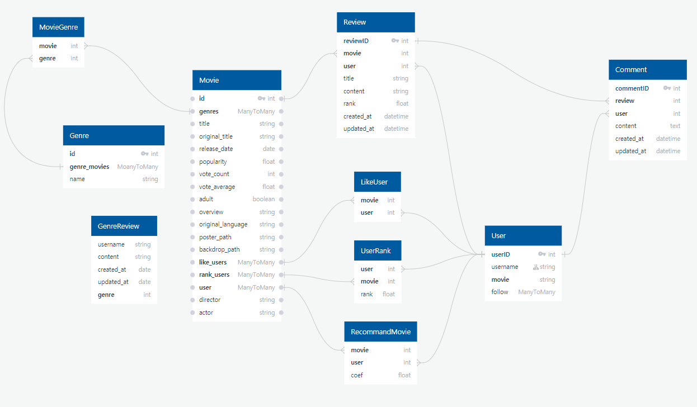 

<br>

## ⭐️ 핵심 기능

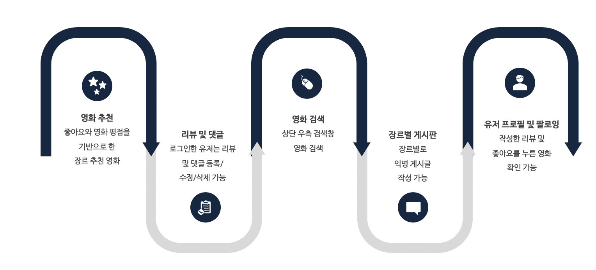

<br>

## 🗃 Project Folder

- 

<br>

## 💡 Pages

> Heroku와 Netlify를 이용해 배포한 웹사이트입니다.

### 회원가입 페이지

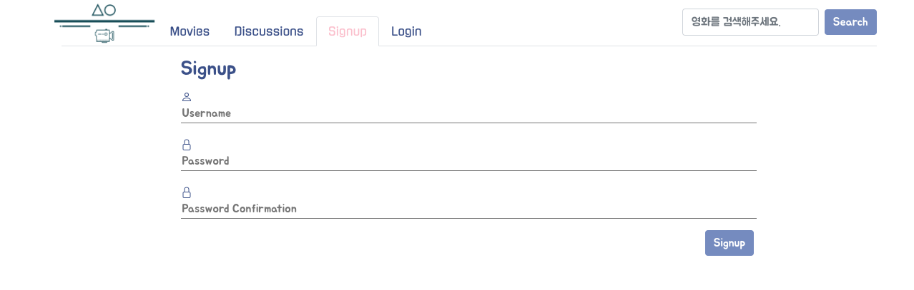


### 회원가입 후 영화 선택 페이지

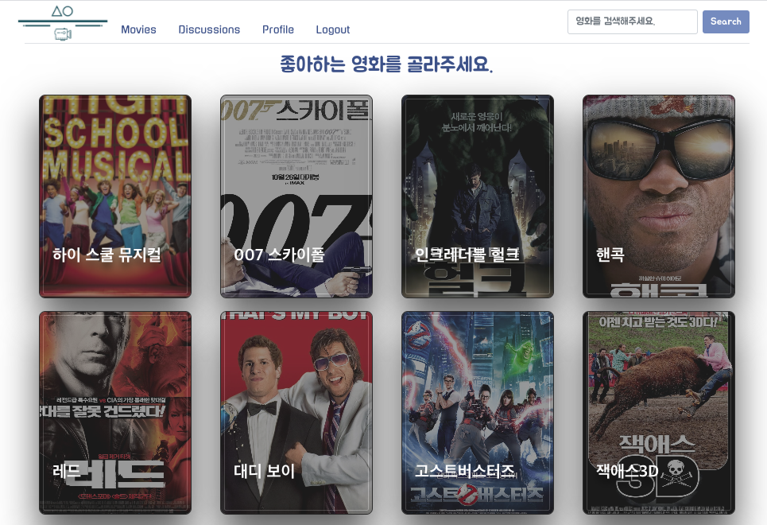

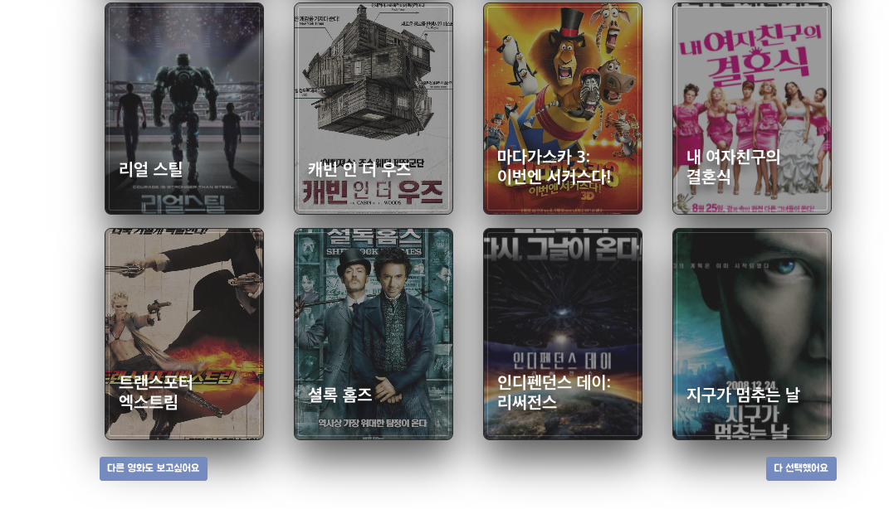


### 로그인 페이지

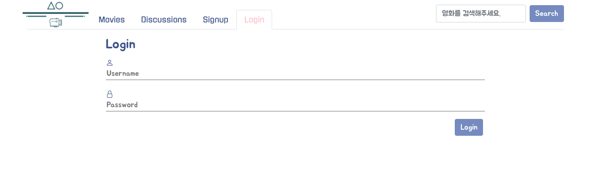

### 메인 페이지

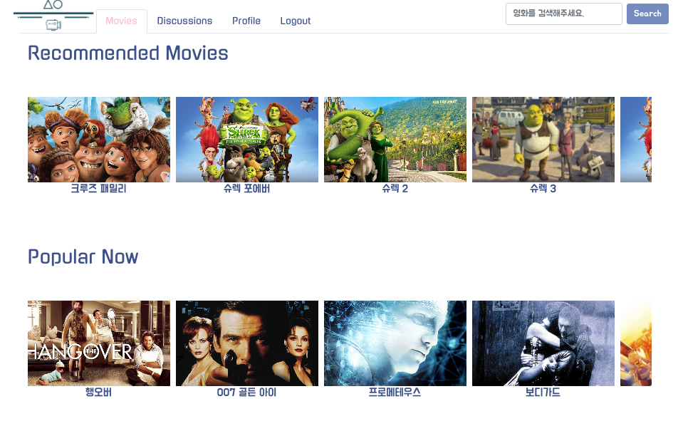

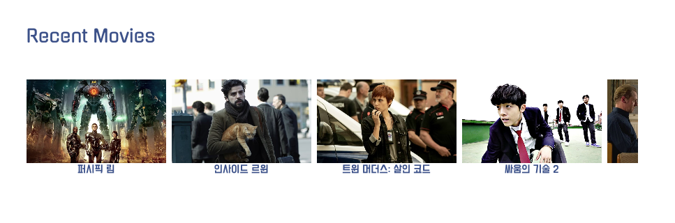

### 영화 상세 페이지

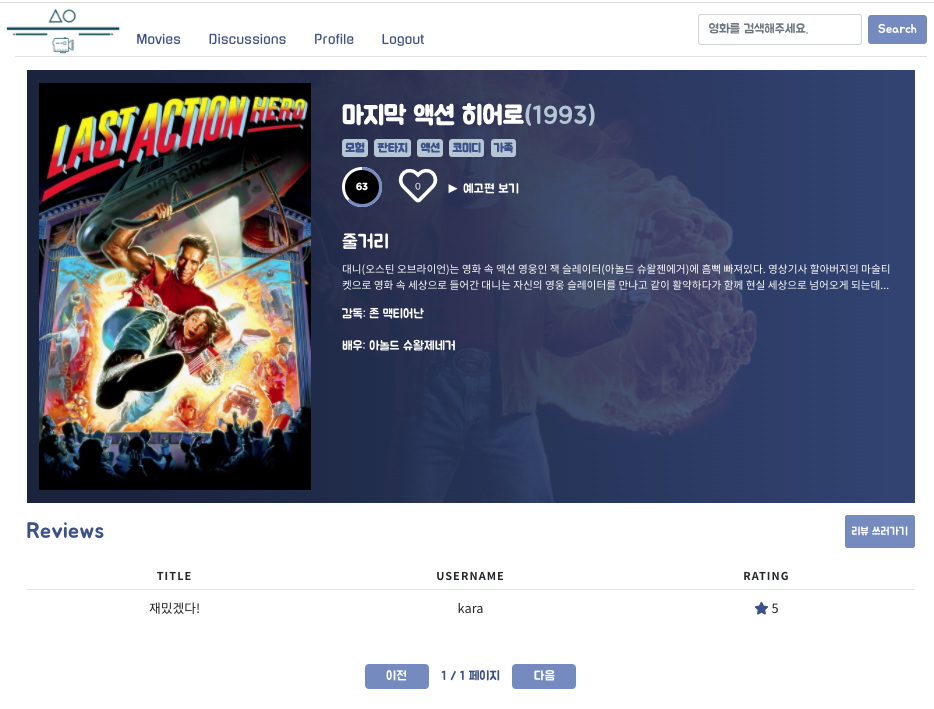


### 리뷰 상세 페이지

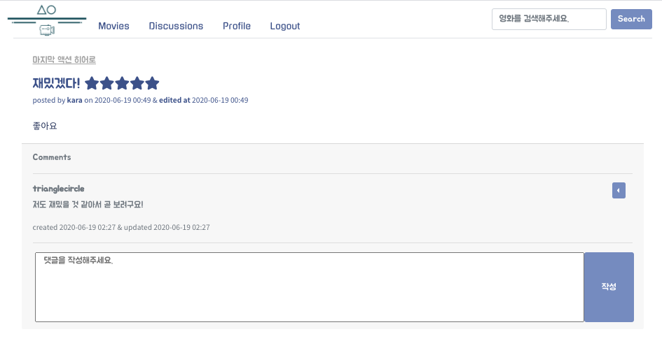


### 프로필 페이지

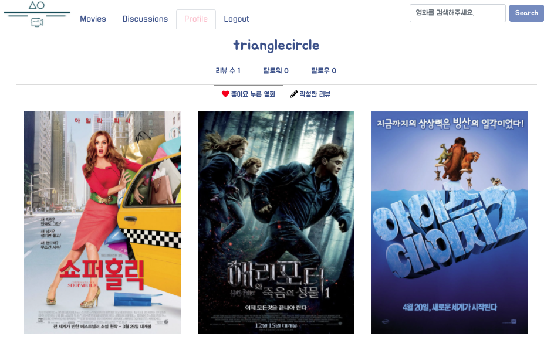

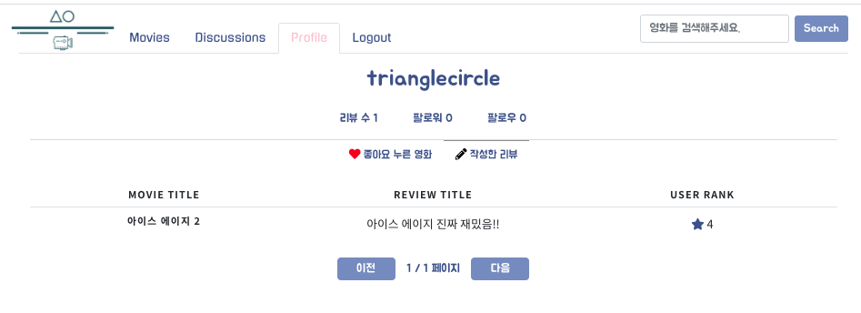


### 장르별 익명 게시판 페이지

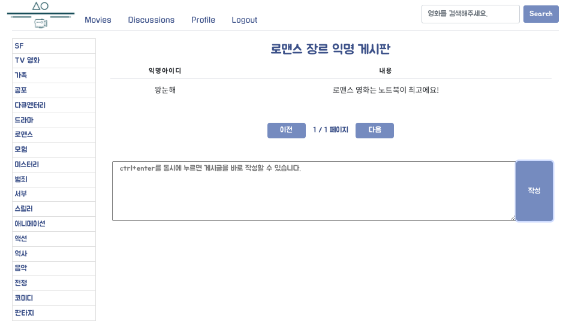

### footer


<br>

## 🎬 Video

- <a href="https://www.youtube.com/watch?v=joCXRFD6VUM&feature=youtu.be">8분 유튜브 영상</a>

<br>

## Show your support

Give a ⭐️ if this project helped you!

***

_This README was generated with ❤️ by [readme-md-generator](https://github.com/kefranabg/readme-md-generator)_