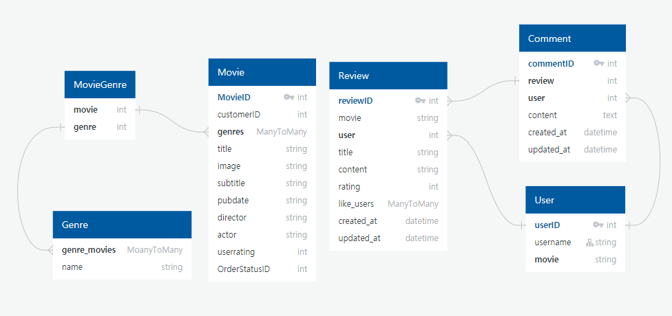

# 20200611

## 회의

### 팀 이름

- 세모동그라미 
  - 웹사이트 이름인 '세상의 모든 영화' (세모영)에서 세모와 동그라미를 본 따 세모동그라미로 팀 이름을 정했습니다.

<br>

### 사용할 아키텍처

- Django REST API
- Vue.js

<br>

### 배포

- Heroku와 Netlify를 이용하기로 하였습니다.

<br>

### 영화 데이터 수집 API 정하기

- 3가지  API 모두 비교하였습니다. 
- 감독과 출연 배우, 그리고 평점까지 원하는 정보가 있는 네이버 DB를 선택하기로 결정하였습니다.
  - <a href="https://developers.naver.com/docs/search/movie/">네이버 검색 API (영화)</a>
- 또한, 관객수를 기반으로 알고리즘으로 계획하기에 관객수가 있는 영화진흥위원회 DB도 사용하기로 결정하였습니다.
  - <a href="https://www.kobis.or.kr/kobisopenapi/homepg/apiservice/searchServiceInfo.do">영화진흥위원회 오픈  API</a>

<br>

### 💡기획

- 서버를 두고, Vue에서 보여주는 식으로 (프론트엔드) 만들기로 결정했습니다.

#### ✓ 프로젝트 기본 기능

- 관리자 권한의 유저
  - 사용자가 관리자이면, 사용자 홈페이지에 영화 생성 탭을 생성
  - 관리자가 아니면, 영화 생성, 수정, 삭제 페이지를 할 수 없음
- 추천 알고리즘
  - 기본
    - 회원가입 후에, 영화를 선택하도록 유도
  - 추천 방식 1
    - 영화는 관객수를 기반으로 TOP 100에서 랜덤으로 추출
    - 그리고 장르를 카운팅해서 알고리즘을 추천
  - 추천 방식 2
    - 계절별로 영화 추천
- 영화 상세 페이지
  - 예고편 보러가기 버튼이나 포스터 클릭 시 유튜브 예고편 모달 팝업
- 영화 목록 페이지
  - 장르별로 영화 보여주기
  - 장르별로 평점 순, 최신 순으로 배열 바꿔주기 
    - 최적화/속도 관련은 생각해보기 
    - DB에 tree구조를 사용할 수 있을까?
- 리뷰, 댓글 목록
  - 각 게시글 및 댓글은 생성 및 수정 시각 정보가 포함하기

<br>

#### 💻화면 구성 

- 어떤 페이지를 만들거고, 어떤 네비게이션 탭을 만들 것인지 정했습니다.
- 회원가입해서 →  영화를 선택하고 (영화 추천 알고리즘) → 메인페이지 이동
- 메인페이지
  - 로그인이 되어있을 때
    - 추천영화
    - 인기영화 
    - 최신영화 (상영중인 영화/개봉일 기준 내림차순 정렬)
  - 로그인이 안되어있을 때 
    - 인기영화 
    - 최신영화 (상영중인 영화/개봉일 기준 내림차순 정렬)
  - 각 영화는 title과 poster를 보여준다.
  - 추천/인기/최신영화는 스크롤바를 이용해 이동한다.
- 세부 영화 페이지
  - 영화를 클릭하면 세부 목록으로 이동
  - 버튼 등을 통해 예고편 모달로 띄우기
  - 리뷰 목록 보이기
- 리뷰 작성 페이지
- 회원 프로필 페이지
  - 좋아하는 영화 담기게 만들기
  - 팔로우 기능

<br>

#### ➕프로젝트 추가 기능

> 시간이 있으면 다음과 같은 기능을 생성하기로 하였습니다.

- 시간이 있으면 유저 간의 채팅 기능 활성화
- 권한을 나누어 유저 관리 (예 - 관리자, 스태프 등)

<br>

## ✓오늘 구현한 내용

- 프로젝트 setup 
- 가상환경 설치
- 모델링 및 DB 작업
- 로고 작업
- login, Signup 목록 페이지 완성
- movie 목록 페이지 완성
  - 스크롤 작업
- movie 디테일 페이지는 미완성 

<br>

## 💡어려웠던 점 및 배운점

### 모델링



- 영화와 리뷰를 중심으로 기본 모델을 구성하였습니다.


### 스크롤바

#### ❗️어려웠던 점

- 영화를 사용자들에게 보여줄 때 가로 형식으로 보여주기 때문에 스크롤바를 어떻게 사용할 수 있을지 고민했습니다.
- 스크롤바 관련 해서 맥에서는 스크롤바가 보이지 않지만, 윈도우에서는 스크롤이 보였고, x와 y방향 모두 스크롤이 있어 스크롤을 없애고, 꾸미는데 어려움을 겪었습니다.

#### ⭐️배운 점

- ::webkit-scrollbar 를 이용해 스크롤바를 꾸밀 수 있다는 점을 배웠습니다.
- 디버그를 할 때 웹브라우저의 개발자 도구를 이용하여 여러 테스트를 하였습니다.

<br>

### Javascript Slicing

#### ❗️어려웠던 점

- 기존에 Django/Python에서 하던 방식으로 `[:]` 슬라이싱을 하여 슬라이싱 되지 않는 문제를 겪었습니다.

#### ⭐️배운 점

- 자바스크립트에서는 `slice(s, f)`를 통해 슬라이싱을 할 수 있습니다.

<br>

### Multiplication

#### ❗️어려웠던 점

- 점수화를 위해 곱하기를 사용해야 했는데, 이를 어떻게 처리해야 할지 고민했습니다.

#### ⭐️배운 점

- Template 내부에서 데이터 역시도 곱하기가 가능하다는 점을 배웠습니다.
- 예시) `{{movie.vote_average*10}}`

<br>

### CSS 전처리기 

#### ❗️어려웠던 점

- stylus, scss를 이용하려고 하는데 Vue.js에 어떤 식으로 설치하는지 몰라 많은 시간이 소요되었습니다. 
- npm으로 설치 후, config에 코드를 써주어도 잘 되지 않았습니다.

<br>

### 클래스 바인딩

#### ⭐️배운 점

- v-bind와 computed를 이용해 복합적인 클래스 이름을 추가하는 것이 가능하다는 점을 배웠습니다.

- ```html
  <div class="progress--circle" :class="computedClass">
  ```

- ```javascript
   computed: {
      computedClass() {
        let className = 'progress--' + this.movie.vote_average*10
        console.log(className)
        return className
      }
    },
  ```

<br>

## 📆내일 구현할 내용

- movie 디테일 페이지 완성하기
- User 페이지 완성하기
- 영화 추천 페이지
- Review 생성 페이지 만들기  + 삭제 기능 + 수정 기능 
- DB 할 수 있으면 완성하기


